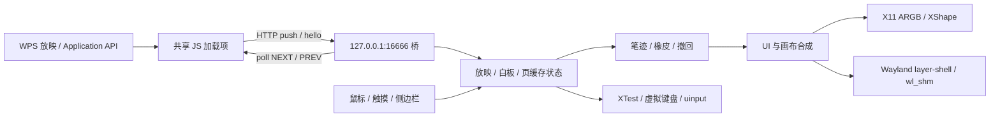

# Sidera 项目完整分析

评审日期：2026-09-30（Asia/Shanghai）。分支：`custom`。代码基线：`0642103ae9d2067efef0be4f15bb515c7aa56e1c`。

本轮交付分析、计划、测试环境说明和诊断脚本；没有实施生产代码重构。问题定位对应上述基线，后续修改后需要重新验证。

## 1. 结论与阅读顺序

项目已经实现屏幕批注的主要教学流程，但现有构建和测试证据不足以支持 README 中“两套实现均可用于生产”的完整兼容性承诺。优先工作是修复笔迹丢失、坐标换算、Wayland 缓冲生命周期和 WPS 状态同步，再逐步拆分模块。

建议按以下顺序推进：

1. 建立隔离、可重复运行的测试，纠正当前测试的误通过。
2. 修复绘图和分页的数据完整性问题，以及 Wayland 内存/协议问题。
3. 统一 WPS 会话、重连、白板恢复和事件去重语义。
4. 统一每种实现内部的业务逻辑，再改进打包和平台能力提示。
5. 在真实教室设备上完成兼容性与性能验收，更新支持范围。

配套文档：

- [需解决的问题与验收标准](ISSUES.md)
- [分阶段重构计划](REFACTOR_PLAN.md)
- [测试环境、命令和用例矩阵](TEST_ENVIRONMENT.md)
- [本次诊断脚本及结果](audit/README.md)

## 2. 检查范围与证据边界

检查了 Rust、C++、WPS 加载项的源代码，构建/打包脚本、CI、现有测试、部署说明、配置和协议文件组织。协议 XML 按项目使用方式检查，并验证 XML 格式；没有对这些上游协议定义重新进行协议审计。

| 内容 | 本轮证据 | 范围限制 |
| --- | --- | --- |
| C++ X11 编译 | WSL Ubuntu 26.04.1 / GCC 15.2.0 / Qt 5.15.18，构建成功 | 没有完成真实桌面的透明、穿透、触摸验收 |
| C++ 独立 WPS 桥 | 编译原始 `wps_bridge.cpp`，用隔离探针运行 | 此桥供 C++ Wayland 使用；没有启动完整 Wayland 图形后端 |
| 现有 Python 接口测试 | 在该原始桥上运行，5/5；同时复现缺失 manifest 仍通过 | 这是端点冒烟，不证明分页正确或真实 WPS 兼容 |
| WPS JavaScript | Node 24.19.0 语法检查、VM 模拟 Application/网络/定时器 | 不能替代 WPS 内嵌运行环境 |
| Shell / XML | 10 个 Shell 脚本在 LF 规范化副本中语法通过；10 个 XML 可解析 | 未构建 DEB、未执行安装到宿主系统 |
| Rust | 静态检查代码和 9 个测试函数 | 环境缺少 Cargo/Rust；没有运行 build/test/clippy |
| Wayland / arm64 / 教室机 | 静态分析，列出验收计划 | 没有实机验证、压测或架构兼容性结果 |

测试副本放在 WSL 的本地文件系统，避免直接从 Windows 的 NAS UNC 工作目录编译。接口探针通过 bubblewrap 隔离网络和用户家目录，避免污染现有 WPS 登记。Windows 工作区的 Shell 文件为 CRLF，Git 索引为 LF；这是跨系统测试注意事项，不能据此认定 Linux 原生检出也有同样错误。

## 3. 现有结构与执行路径

项目实际有四条运行路径：Rust X11、Rust Wayland、C++ X11、C++ Wayland，另有一套共享 WPS JS 加载项。

此图描述共同职责。Rust 上层大部分共用；C++ Wayland 重新实现了很多 UI、页面、配置与交互逻辑，不能将两版、两个平台视作功能完全一致。

### Rust

| 模块 | 当前职责 | 主要维护问题 |
| --- | --- | --- |
| `main.rs` | 启动、输入路由、UI 动作、渲染调度、截图保存、单实例、WPS 定时任务 | 1,675 行，混合应用规则和平台事件；不便单独测试状态转换 |
| `app.rs` | 常量、公共状态、撤回瓦片、页缓存、设置读写 | App 同时承载 UI、文档、输入和配置；缓存尺寸/会话身份没有约束 |
| `paint.rs` | tiny-skia 画笔、橡皮、并集路径、撤回区域 | 物理像素与逻辑坐标混用；并集整笔测试未覆盖实际增量绘制路径 |
| `gesture.rs` | 单点/多指/大触点角色状态机 | 缺少状态机测试，按单事件而非完整触摸帧决策 |
| `ui.rs` / `text.rs` | 手绘侧栏、命中区域、设置、字体栅格化 | 1,221 行 UI；系统字体覆盖、低分辨率布局需验证 |
| `backend.rs` | 平台抽象 | 缺少明确的能力表和错误返回；部分无操作看起来像成功 |
| `x11.rs` | x11rb 覆盖层、输入区域、注入、全屏扫描、截图 | 显示拓扑变化、热键错误和全屏识别需完善 |
| `wayland.rs` | SCTK/calloop、layer-shell、双缓冲、seat、缩放、注入 | 1,004 行；缓冲写入、初始化画布和输出变化有高优先级问题 |
| `wps.rs` | 单线程 HTTP、共享状态、登记、日志 | 与 App 重复维护真实页号，测试有真实家目录副作用 |
| `portal.rs` / `uinput.rs` | 门户截图 / 内核按键注入 | 截图请求竞态、超时和失败反馈；uinput 可用性不等于覆盖层兼容 |

共 13 个 `.rs` 文件、6,803 行（含空行、注释、测试），另有 2,074 行内嵌 keymap。统计用于识别责任集中，不作为代码质量评分。

### C++ / Qt

| 模块 | 当前职责 | 主要维护问题 |
| --- | --- | --- |
| `app.h` / 全局 `g` | 公共状态、Qt/X11 依赖、裸指针资源 | 业务、UI、平台混合；资源所有权和初始化顺序隐含 |
| `widget.h` / `widget.cpp` | 主窗口、建侧栏、鼠标/触摸、绘图事件 | 606 行实现放在头文件，`.cpp` 几乎只负责包含头文件 |
| `drawing.cpp` | 画笔、橡皮、撤回、图标 | 绘图纯函数已存在，可以保留；撤回为全屏快照 |
| `sidebar.cpp` / `popups.cpp` / `settings.cpp` / `modes.cpp` | Widget UI、设置、XShape、按键 | 各自直接修改全局状态，难以验证动作顺序 |
| `wps.cpp` | X11 HTTP、登记、缓存、配置、全屏识别 | 同一文件有多种职责，部分逻辑与独立桥重复 |
| `wps_bridge.cpp` | 独立桥，供 Wayland 使用 | 与 X11 桥事件语义不同；定时器停止不完整 |
| `backend_wayland.cpp` | 裸 Wayland + QPainter 的完整应用路径 | 1,214 行，另有一套分页/设置/触摸状态；运行时配置变化没有完整重建 |
| `main.cpp` / `splash.cpp` | 平台选择、单实例、启动和退出 | Linux 会话判定与功能可用性耦合，退出状态需统一 |

共 15 个 `.cpp/.h` 文件、4,618 行。相比“两个语言版本”，更现实的成本是同时维护四条功能路径。

### WPS 加载项与协议

入口为 `index.html → main.js → js/bridge.js`，功能区从 `ribbon.xml` 加载。登记指向 `http://127.0.0.1:16666/`。

| 端点 | 当前语义 | 缺失的契约 |
| --- | --- | --- |
| `/hello?m=...` | 上线问候 | 客户端/会话身份、协议版本、能力协商 |
| `/push?m=EVENT ...` | 开始、结束、真实页号与动画索引 | 演示文稿标识、会话、事件序号、重放/确认规则 |
| `/poll` | 从队列取一条 NEXT/PREV | 命令编号、执行确认、过期、断线处理 |
| 静态路径 | 提供 XML/JS/HTML | 404、资源白名单、正确的加载健康判定 |

300ms 的轮询使按钮到加载项执行之间最多多等约一个轮询周期，再叠加调度/网络时间；本轮没有测出实际课堂延迟。应先测量，再决定是否改成短轮询、长轮询或其他传输方式。

## 4. 关键技术判断

### 笔迹完整性优先于界面重写

已定位到 Rust 1920×1080 Wayland 默认画布初始化、DPI 撤回区域、WPS 容量静默丢页、缩放后旧缓存尺寸、两套放映信号重复清空等问题。仅整理文件不能修复这些状态规则；需要先定义并验证“当前页、会话、画布尺寸、未完成笔画”的不变量。

### Wayland 是能力组合，不是单一兼容标记

两个 Wayland 后端都要求 `wlr-layer-shell`。Rust 的 uinput 回退只处理部分按键注入；不能让缺少 layer-shell 的桌面拥有可用覆盖层。Rust 的截图方法当前总是返回 `None`，因此实际走 Portal；C++ 走 screencopy，缺少 Portal 回退。Rust Wayland 虚拟右键为空实现，C++ Wayland 也没有与 X11 相同的手掌橡皮流程。

应以“覆盖层、穿透、触摸、热键、注入、截图、剪贴板”逐项列支持范围，并根据实际公告的协议做判断。不能仅通过 `WAYLAND_DISPLAY` 是否存在决定全部能力。

### 缓存需要内存预算和明确的保留规则

RGBA 全屏快照成本为 `宽 × 高 × 4` 字节。3840×2160 的单页约 31.6MiB，20 页约 633MiB；若同时保留 10 页白板，再加约 316MiB。画布、渲染副本、撤回和分配开销还在此之外。这里只是计算值，未经 RSS 实测。

Rust 的瓦片撤回是可保留的优化，但分页仍是整屏快照；C++ 的撤回和缓存也可能产生全屏复制。必须明确超预算时如何保留、落盘或提示，禁止在授课过程中静默丢弃。

### 共享协议与行为用例，比跨语言强行复用实现更重要

建议让两版共享协议规范和测试数据；Rust 每个后端共用一个应用状态机，C++ 也共用一个页面/放映控制器。暂不引入跨语言 FFI、微服务或新的 Web UI，避免在正确性尚未稳定时增加部署复杂度。

## 5. 构建、发布与测试现状

- CI 只在 `main` push、面向 `main` 的 PR 时触发；`custom` 的普通 push 没有该工作流保护。
- C++ CI 仅构建并检查文件存在，没有运行现有 Python 测试，也没有显式覆盖 Wayland 编译。
- Rust CI 有 release build、9 个源内测试及 clippy；后续 S14 修复增加了打包架构回归检查。仍没有 fmt 检查、警告失败策略、隔离家目录或真实桌面测试。
- 容器脚本依赖被 `.gitignore` 排除的两个 rootfs，仓库没有可复现的生成步骤、下载来源或校验和；干净检出无法直接执行 README 的一键构建。
- C++ DEB 手写依赖缺少直接链接的 Qt5Network；Wayland 产物的额外库也没有统一生成依赖。
- 初次评审发现 Rust DEB 的 arm64 路径可回退到本机 `target/release/sidera`，没有校验 ELF 架构；后续 S14 修复已加入架构保护及回归测试。最低 glibc 仍只声明、没有作为发布门禁验证。
- 本次 Ubuntu 26.04 编译的 C++ 文件需要 `GLIBC_2.34` 和 `Qt_5.15` 符号，不可作为 Qt5.12/旧 glibc 发行版的兼容证明。
- 用户补充反馈编译安装后应用图标不显示，已单列 S28。脚本包含图标复制步骤，实际包内容与目标桌面显示尚待复现；修复计划与 G22 验收覆盖全新安装、升级和重装。

具体风险、修复和验收见问题清单及测试环境文档。

## 6. 维护方向与仍需确定的信息

建议 Rust 作为主要功能演进路径，C++ 保持兼容修复和参考实现。只有 Rust 在实际部署平台上达到功能与稳定性验收后，再决定是否缩减 C++ 维护范围；本轮未作删除决定。

后续部署前需要补齐：教室发行版与版本、CPU 架构、桌面/合成器版本、WPS 完整版本、触控设备型号及轴信息、常用课件大小、可接受的缓存保留和内存预算。这些数据暂缺，测试环境文档将它们列为实机记录项，而非假定已经支持。
