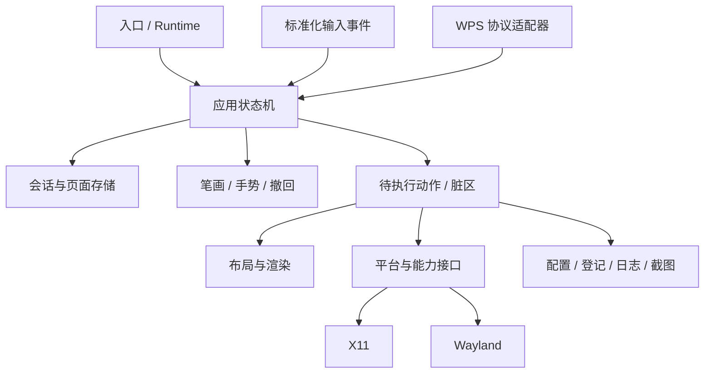

# 重构计划

日期：2026-09-30。适用分支：`custom`。所有阶段目前为计划，问题编号见 [ISSUES.md](ISSUES.md)。阶段按验收推进；没有承诺未经实测的完成日期。

## 1. 目标与约束

目标是让笔迹不因分页/重连/显示变化意外丢失，让各平台的支持能力可判断，让一次修复能够通过测试持续保持。

- Rust 继续作为主要演进实现；C++ 先承担兼容修复和对照验证。
- 保留 Qt/tiny-skia 已能独立使用的绘图函数和 Rust 瓦片撤回，不为重构替换渲染技术。
- 同一种语言的 X11/Wayland 共用业务规则，两种语言共享协议与行为测试数据。
- 每次提交围绕可验证行为，先补能揭示问题的测试，再修改行为，再移动代码。
- 先在 `custom` 做修改。若需要临时工作分支，必须记录其与 custom 的关系；发布与主分支合并按后续任务处理。
- 生产代码改动不与许可变更、移除 C++、自动迁移用户全部配置等决策混在一起。

## 2. 目标结构



### Rust 拆分建议

下列目录为拟新增结构，不是当前已经存在的模块：

```text
rust/src/
  main.rs                # 参数、平台选择、退出码
  lib.rs                 # 可被测试引用的应用逻辑
  core/
    state.rs             # ToolMode / Workspace / AppAction / Effect
    presentation.rs      # 会话状态、权威页号、白板恢复
    pages.rs             # PageKey、缓存、几何、字节预算
    input.rs             # 统一鼠标/触摸帧与取消
    gestures.rs          # 可注入时钟的手势 FSM
    undo.rs              # 瓦片撤回
  render/
    strokes.rs           # 真实交互使用的笔迹路径
    layout.rs            # 渲染和命中共用布局
    ui.rs / fonts.rs
  platform/
    mod.rs               # Capabilities / Result / Geometry
    x11.rs
    wayland.rs           # 连接、输出、输入，按需继续拆 buffer 模块
  integration/
    wps.rs               # HTTP 与协议，不直接修改画布
    portal.rs
    clipboard.rs
  persistence/
    config.rs / addin.rs / log.rs
```

首先抽出有测试边界的控制器和存储，后续再按实际规模移动文件，避免一次改动全部 import。

### C++ 拆分建议

- `AppState` 分成 Config、DrawingSession、PresentationSession 和 UiState；资源用 QObject parent、值类型或智能指针明确管理。
- 新建 PageStore/PresentationController/InputController；X11 Widget 与 Wayland 后端调用同一控制器。
- X11 也使用修复后的 `WpsBridge`，删除旧 HTTP 实现前通过统一行为用例。
- `widget.h` 保留声明，把建 UI、事件处理和绘制移入 `.cpp`；平台协议回调不再把整个 WlBackend 的内部状态公开。
- Wayland 后端保留 QPainter 渲染，但不再另行定义页容量、放映生命周期和登记行为。

## 3. 必须先明确的不变量

| 范围 | 不变量 |
| --- | --- |
| 坐标 | 输入/UI 逻辑坐标；像素/撤回为物理坐标；只通过一个 Geometry 转换，边界向外取整 |
| 画布 | canvas 尺寸总等于当前几何计算的物理尺寸；缓存带 geometry/version |
| 笔画 | 页/模式/几何变化前明确提交或取消正在绘制的笔画，不能跨页继续 |
| 会话 | `(presentation_id, session_id, page_id)` 标识页；单一控制器持有权威位置 |
| 放映 | Begin/End/重复事件幂等；在线加载项优先，全屏扫描仅为降级观察 |
| 白板 | 外部事件不改白板墨迹；外部最新状态仍被记录，退出时重新同步 |
| 撤回 | 一次完整用户操作对应一步，DPI 不改变撤回区域覆盖正确性 |
| 缓存 | 页数和字节预算都有上限，任何淘汰可说明，不静默丢内容 |
| Wayland | 只有 released buffer 可写；尺寸变化不得复用仍被使用的旧存储 |
| IO | 测试不能写真实家目录；写配置/登记为原子操作，失败可观察 |

## 4. 分阶段执行与验收

### 阶段 0 — 测试基线和隔离设施

解决/覆盖 S13、S22、S27，作为后续正确性修复的依赖。

交付：

1. 固定已验证的 Rust 工具链并记录 GCC/Qt/协议扫描器版本；补 LF 约定和显式 Wayland 构建检查。
2. 让桥的端口、注册路径、静态资源路径、时钟和日志可注入；Rust 测试使用临时端口和目录。
3. 修正 Python 断言：正确 manifest/XML、错误码、NEXT/PREV 队列、状态副作用；不再把服务不存在或被占用当通过。
4. 将本次诊断现象转成正式失败测试。诊断脚本只记录现象，不能直接当发布门禁。
5. 在 custom push/PR 启动 CI；分别验证 C++ X11 和 Wayland，Rust fmt/test/clippy。

退出条件：干净检出能跑无图形业务测试；故意删 manifest、占生产端口、破坏队列能被准确判定；测试不修改真实用户文件。此阶段不宣称完成 Wayland/触屏验收。

### 阶段 1 — 画布、坐标与缓冲正确性

解决 S01、S02、S03、S04、S21。先修单项问题，再抽 Geometry/Undo/BufferPool。

交付：

1. 修复默认画布初值，给 App 构造/resize/scale 加尺寸约束。
2. 统一撤回区域换算和 dirty rectangle，验证边缘/跨瓦片/变化笔宽。
3. Rust buffer 按 release 与内容代次更新；重配置分配新 pool，延迟回收旧 pool。
4. C++ configure/scale 共用资源重建流程；分配大小上限、错误和清理有明确路径。
5. 决定旧页在缩放/输出变化后的恢复策略，并实现一致行为。

退出条件：像素级撤回比较通过；默认1080p与4K/125%通过；缓冲 busy/resize 测试通过；C++ ASan/UBSan 无越界；热插拔仍需在真实输出上验收。

### 阶段 2 — WPS 会话、可靠性与登记

解决 S06—S12、S15，依赖阶段 0 的可控桥和阶段 1 的画布约束。

交付：

1. 一个 PresentationController 处理 Begin/State/End/离线/白板，无窗口扫描重复 clear。
2. JS 启动/事件注册幂等；上报确认、失败重试、定期快照、放映生命周期检测。
3. 桥/上层同页重连重新同步；白板退出应用最新外部快照。
4. 统一 C++ 桥并补 End 回调、启停/连接清理；注册用结构化 XML 合并。
5. 建立协议版本、客户端/session/序号、方法/大小/队列约束，并验证实际 WPS 兼容性。

退出条件：共享事件序列在 Rust、C++、JS 的观察结果一致；断线、重复、乱序、桥重启不丢页；其他加载项登记保留；启停100次无 timer/连接残留。

### 阶段 3 — 页面存储、手势与资源预算

解决 S05、S20、S24、S25 中的状态/内存部分。

交付：

1. PageStore 从公共状态中分离；统一四条路径的缓存规则。
2. 记录缓存字节数，按预算执行保留/淘汰；可先采用内存 LRU + 明确提示，再根据教学保留要求增加落盘。
3. 帧化触摸输入、取消/抬手/静止规则、shape 到达顺序；将手势状态机独立测试。
4. 配置有限值/范围校验、原子写、失败反馈；时长使用单调时钟。
5. 测量 idle CPU、输入延迟、4K内存、窗口扫描/日志成本，再决定事件驱动和脏区优化。

退出条件：21/50页、12次撤回、10页白板和混合输入用例通过；内存随预算受控；性能记录包含硬件与负载，不用主观“流畅”替代数据。

### 阶段 4 — 平台能力、截图与结构收尾

解决 S16—S19、S24、S26 的剩余内容。

交付：

1. Capabilities 表以及可失败的注入/截图/输入区接口；不可用操作有准确 UI 状态。
2. Portal 提前订阅、超时/取消、URI解析；剪贴板作为持久服务，验证真实粘贴。
3. Wayland 协议版本、seat、output 生命周期，双屏/整数和分数缩放。
4. 有协议缺失时的可理解启动结果；不把 uinput 当覆盖层兼容方案。
5. 依据已稳定测试逐块拆 main/UI/widget/WlBackend，保留行为基线。

退出条件：目标桌面的支持表与诊断/按钮/行为一致；所有列入支持的平台完成测试环境文档中的图形与外设用例。

### 阶段 5 — 可复现打包与教室发布验收

解决 S14、S22、S23、S27 的发布部分及 S28。S28 的复现和最小修复可提前独立交付，完整发布验收在功能开发冻结后执行。

交付：

1. rootfs/构建镜像生成步骤、校验和和工具链锁定；构建参数明确记录 X11/Wayland 能力。
2. 包含架构、最低 ABI、依赖和资源的自动验证；禁止错误架构回退。
3. amd64/arm64 在最低支持系统执行安装、升级、两版替换、启动、卸载和自启动测试。
4. 一节课流程与长时间压力测试；汇总未通过项、实际支持范围和回退方案。
5. 统一版本来源、README与部署说明；由作者确定许可元数据后再同步修改。
6. 修复安装后应用图标缺失：从实际安装包复现，核对资源、desktop 入口、应用身份和桌面缓存处理；统一两种实现的图标安装约定，将 G22 纳入发布验收。

退出条件：每种发布包有对应构建/测试记录和校验和；已知缺陷写清；生产支持声明只覆盖已经通过的组合。

## 5. WPS 协议迁移草案

这是拟议协议，不是现有端点已经支持的格式。正式实施前先验证当前 WPS 的 fetch、header、存储和 Origin 行为。

```json
{
  "protocol": 2,
  "client_id": "addin-instance-id",
  "session_id": "slideshow-session-id",
  "presentation_id": "presentation-identity",
  "seq": 42,
  "kind": "state",
  "showing": true,
  "page": 5,
  "click": 2
}
```

- 新接口用结构化请求和明确响应码；命令带 command_id/TTL，并在执行后确认。
- 心跳携带完整状态；事件序号用于去重，重连快照恢复当前页而不是依赖“下一次翻页”。
- presentation_id 应选稳定且不泄露课件完整路径的标识；无法取得稳定身份时明确降级，不把不同文稿的第1页当同一页。
- 控制端点的会话凭据应经受控握手传递；不要把长期密钥放在公共 JS 文件。静态资源与控制 API 的访问规则分别设计。
- 迁移期保留旧 GET 协议适配器并记录能力，支持旧包/新加载项与新包/旧加载项组合；旧协议模式也需要边界限制。
- 单次 release 中不要直接把现有 WPS 端点全面切换成不兼容协议。

## 6. 建议的首批变更粒度

| 顺序 | 可独立审查的变更 | 必须关联的验证 |
| --- | --- | --- |
| 1 | 端口/目录注入，修正接口测试误通过与副作用 | 缺资源、端口占用、真实家目录不变 |
| 2 | 默认画布与 DPI 撤回修复 | 1080p初值、缩放像素比较 |
| 3 | Rust Wayland busy-buffer 与 C++ resize修复 | 缓冲单元测试、ASan/实机resize |
| 4 | JS 幂等、上报重试与 Begin/End轮询 | 本次JS探针升级为回归断言 |
| 5 | WPS 会话控制器、白板恢复 | 同页重连、白板外部换页、重复Begin |
| 6 | C++ 统一桥和登记合并 | 两后端统一fixture、多加载项XML、启停 |
| 7 | PageStore 容量/预算与打包架构保护 | 21/50页、错误架构拒绝、内存测量 |
| 8 | 安装后应用图标修复（S28，可提前独立处理） | 实际包全新安装/升级/重装，菜单、收藏及适用的窗口图标 |

2026-09-30 进度：已先完成第 7 项中的 Rust 打包架构保护（S14），5 组、17 个回归场景通过，并接入现有 CI。该进度不代表 PageStore、最低 ABI 或原生安装启动验收完成。

每一步完成后更新对应 Sxx 的状态和证据。阶段计划不意味着要等待所有结构拆分完成才修复已知丢笔迹问题。
